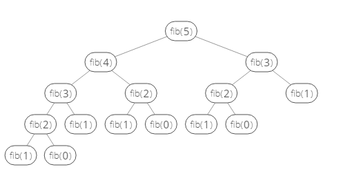

# Dynamic Programming and Recursion

## Overlapping Subproblems

### Overview

A problem has ​ overlapping subproblems​ if finding its solution involves solving the ​ same
subproblem multiple times.

As an example, let's look at the Fibonacci sequence
the series where each number is the sum of the two previous ones = {0, 1, 1, 2, 3, 5, 8, ...}

If we wanted to compute the ​ n th Fibonacci number, we could use this simple recursive algorithm:

```javascript
function​ ​ fib​(​ n​ ) {
    if​ (n ===​ 0 || n === 1) {
        return​ n;
    }
    return​ fib(n​ -1) + fib(n​ -2);
}
```

We'd call​ fib(n-1)​ and fib(n-2)​ subproblems​ of fib(n)​.

Now let's look at what happens when we call ​ fib(5)​:



Our function ends up recursively calling ​ fib(2)​ ​ three times ​ . So the problem of finding the ​ n ​ th
Fibonacci number has overlapping subproblems.
